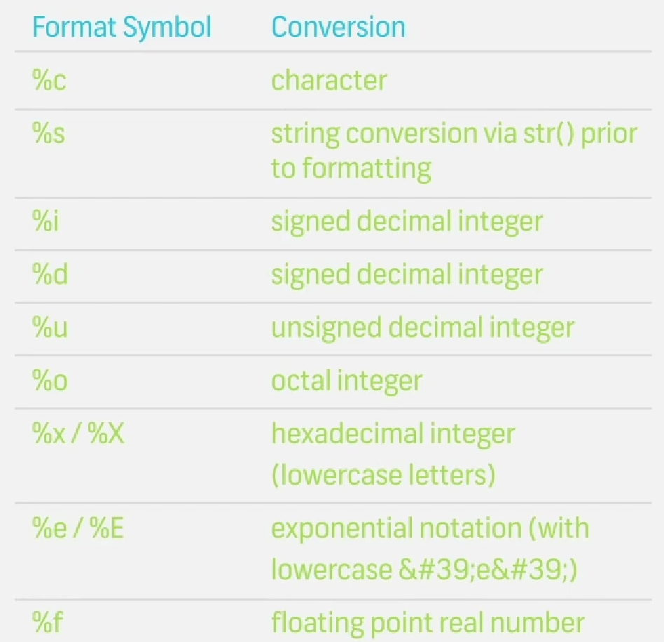
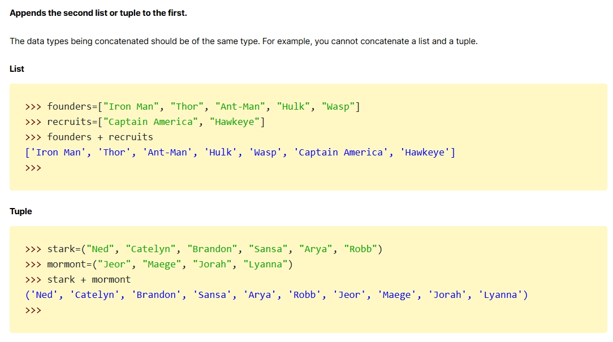
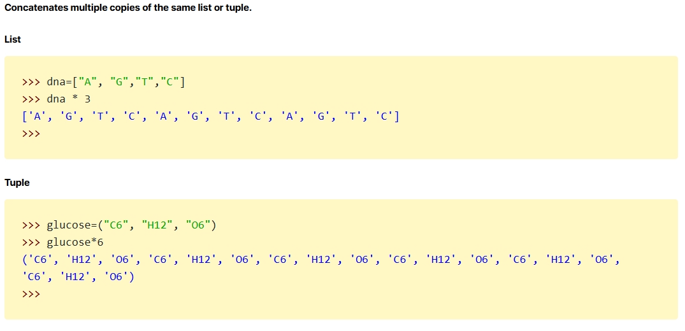
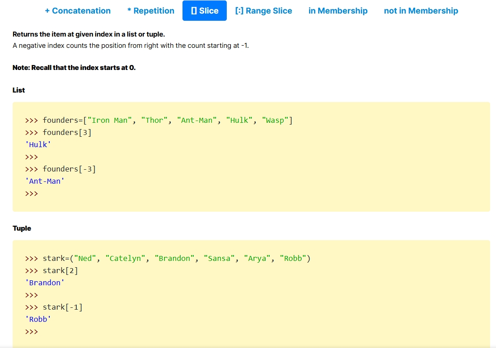

# Some of the important to note.

1. **Keywords** -> if and while etc <!-- keywords always start with smaller case. -->
2. **Class** -> Complex, Exception etc <!-- Classes always start with Upper case. -->
3. **Private Variable** -> _Variable, _variable etc <!-- Private variables always start with the single _. -->
4. **Strongly private Variable** -> __Variable, __variable etc <!--Strongly private variables always start with the double __. -->
5. **Special Purpose** -> __Variable__, __variable__ etc <!--these are created using double __ on both side. -->

### Make sure to refer these images as I doesn't read all right now.

**Functions which can be perfomed on sets are:**

**Functions which can be perfomed on list and tuples are:**

<!-- List ko tuple and tuple ko list me convert kra ja sk ta hai -->

1. by use list() and tuple()
2. also there are some functions available too which can be perform on these.
**functions are:**
append()
insert()
remove()
pop()
reverse()
sort()

<!-- Summary of List and Tuples -->

<!-- Dictionary -->

dict = {"Dev":0,"Sa":2,"Samrat":1}